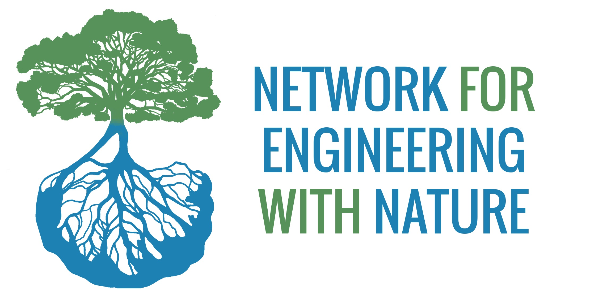

# **Course Logistics**

::: columns
::: {.column width="50%"}
[UGA Institute for Resilient Infrastructure Systems](https://iris.uga.edu/)  
October 23-26, 2025  
9:00-5:00 PM (daily)  

Instructional team:

- [Dr. Brian Bledsoe](https://bledsoe.engr.uga.edu/brian-bledsoe/), [Institute for Resilient Infrastructure Systems](https://iris.uga.edu/), University of Georgia.  
- [Dr. Kyle McKay](https://skmckay.github.io/), Environmental Director, [Woolpert](https://woolpert.com/).

:::

::: {.column width="50%"}
```{r echo=FALSE}

```
:::
:::

# **Overview**

Insert.

Download syllabus.


# **Course Overview**


- 12:30-1:00: Arrive & coffee  
- 1:00-1:15: Welcome and introductions (Suedel).  
- 1:15-1:45: The changing landscape of nature-based solutions (McKay).  
- 1:45-2:15: Improving navigability of natural rivers with sustainable approaches (Creech).  
- 2:15-2:45: Sustainable sediment management (Suedel).  
- 2:45-3:00: BREAK.  
- 3:00-3:45: Technical-biological bank protection (McKay).  
- 3:45-4:15: Discussion of nature-based solutions and sustainable sediment management.  
- 4:15-4:30: Closing remarks (Suedel).  
- 4:30: Adjourn.  
- 5:00-7:00: Conference welcome reception.  


# **Thursday (Oct 23)**

Insert.

Download handouts.

Links to pertinent resources.


# **Friday (Oct 24)**

Insert.

Download handouts.

Links to pertinent resources.


# **Saturday (Oct 25)**

Insert.

Download handouts.

Links to pertinent resources.


# **Sunday (Oct 26)**

Insert.

Download handouts.

Links to pertinent resources.

