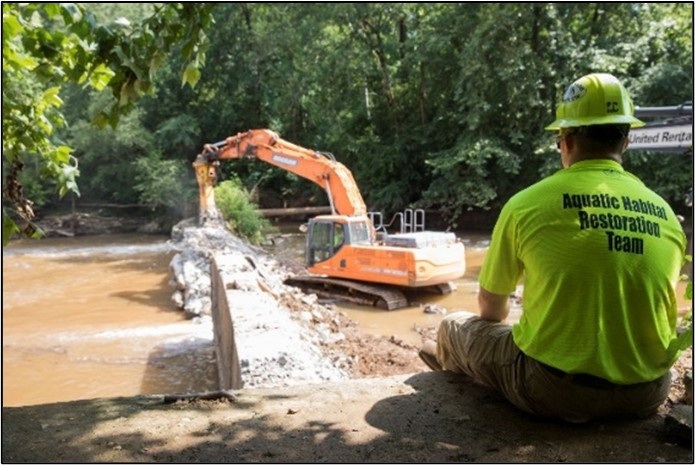

# **Welcome to the class!**

::: columns
::: {.column width="40%"}
*What*:  
UGA short course on natural infrastructure  
[Course syllabus](UGA_NI_Field_Course_Syllabus_2025-09-15.pdf)

*When*:  
October 23-26, 2025  
9:00-5:00 PM (daily)  

*Instructors*:  
[Dr. Brian Bledsoe](https://bledsoe.engr.uga.edu/brian-bledsoe/), Director, [Institute for Resilient Infrastructure Systems](https://iris.uga.edu/), University of Georgia  

[Dr. Kyle McKay](https://skmckay.github.io/), Environmental Director, [Woolpert](https://woolpert.com/)  
:::

::: {.column width="60%"}
```{r echo=FALSE}
knitr::include_graphics("NEWN-fullcolor-horizontal.jpg")
```
:::
:::

# **Course Overview**

The course will cover various topics related to the planning, design, and execution of nature-based solutions for water resource management. Students will explore these topics through fieldwork components, engaging in hands-on activities and gaining practical experience. Field sites around Athens will be visited to observe and study the interaction of natural systems and infrastructure.  These activities aim to deepen understanding of concepts discussed in other UGA courses on natural infrastructure and bridge the gap between theoretical knowledge and real-world application. The course also offers a unique opportunity for students to collaborate with professionals, experts, and local stakeholders involved in diverse ecosystems. Safety protocols and guidelines will be provided to ensure the well-being of all participants during fieldwork. 


The approximate course schedule is shown below. However, all items are subject to change based on visitor availability, weather, and other factors. This intensive, four-day timeline will give us a great opportunity to see natural infrastructure features, but there will not be much time for reading. As such, we require and recommend the following references, which set the stage for getting the most out of our limited time together.

**Required reading**:  

- Booth, D.B. and Fischenich, C.J., 2015. A channel evolution model to guide sustainable urban stream restoration. Area, 47(4), pp.408-421. [pdf](https://faculty.washington.edu/dbooth/Booth%20and%20Fischenich_urban%20channel%20evolution%20model_Area%202015.pdf)  
- Fischenich, C., 2008. The application of conceptual models to ecosystem restoration. Engineer Research and Development Center, Vicksburg, MS. [open access](https://apps.dtic.mil/sti/pdfs/ADA477865.pdf)  
- Gregory, R.S. and Keeney, R.L., 2002. Making smarter environmental management decisions. Journal of the American Water Resources Association, 38(6), pp.1601-1612. [open access](https://onlinelibrary.wiley.com/doi/abs/10.1111/j.1752-1688.2002.tb04367.x)  
- Hicks C.C., Levine A., Agrawal A., Basurto X., Breslow S.J., Carothers C/. Charnley S., Coulthard S., Dolsak N., Donatuto J., Garcia-Quijano C., Mas-cia M.B., Norman K., Poe M.R., Satterfield T., St. Martin K., and Levin P.S. 2016. Engage key social concepts for sustainability. Science, 352 (6281), 38-40. [pdf](https://www.fs.usda.gov/pnw/pubs/journals/pnw_2016_hicks001.pdf)  
- Jackson, C.R., Wenger, S.J., Bledsoe, B.P., Shepherd, J.M., Capps, K.A., Rosemond, A.D., Paul, M.J., Welch‐Devine, M., Li, K., Stephens, T. and Rasmussen, T.C., 2023. Water supply, waste assimilation, and low‐flow issues facing the Southeast Piedmont Interstate‐85 urban archipelago. JAWRA Journal of the American Water Resources Association, 59(5), pp.1146-1161. [open access](https://onlinelibrary.wiley.com/doi/full/10.1111/1752-1688.13130)  
- McKay S.K., Wenger S.J., van Rees C.B., Bledsoe B., and Bridges T.S. 2023. Jointly advancing infrastructure and biodiversity conservation. Nature Reviews Earth & Environment. https://doi.org/10.1038/s43017-023-00484-z. [pdf](https://skmckay.github.io/publications/McKay%20et%20al.%20-%202023%20-%20Biodiversity-Infrastructure.pdf)  
- Palmer, M.A. and Febria, C.M., 2012. The heartbeat of ecosystems. Science, 336(6087), pp.1393-1394. [pdf](https://slunik.slu.se/kursfiler/PNG0057/P0019.1415/Palmer_heartbeat_ecosystems.pdf)  


**Recommended reading**:  

- Cluer, B. and Thorne, C., 2014. A stream evolution model integrating habitat and ecosystem benefits. River Research and Applications, 30(2), pp.135-154.  
- Doyle, M.W., Stanley, E.H., Havlick, D.G., Kaiser, M.J., Steinbach, G., Graf, W.L., Galloway, G.E. and Riggsbee, J.A., 2008. Aging infrastructure and ecosystem restoration. Science, 319(5861), pp.286-287.  
- Jackson C.R., Martin J.K., Leigh D.S., and West L.T. 2005. A southeastern piedmont watershed sediment budget: Evidence for a multi-millennial agricultural legacy. Journal of Soil and Water Conservation, 60 (6), 298-310.  
- Mace, G.M., 2014. Whose conservation?. Science, 345(6204), pp.1558-1560.  
- Nesshöver, C., Assmuth, T., Irvine, K.N., Rusch, G.M., Waylen, K.A., Delbaere, B., Haase, D., Jones-Walters, L., Keune, H., Kovacs, E. and Krauze, K., 2017. The science, policy and practice of nature-based solutions: An interdisciplinary perspective. Science of the total environment, 579, pp.1215-1227.  
- Palmer, M.A., Bernhardt, E.S., Allan, J.D., Lake, P.S., Alexander, G., Brooks, S., Carr, J., Clayton, S., Dahm, C.N., Follstad Shah, J. and Galat, D.L., 2005. Standards for ecologically successful river restoration. Journal of Applied Ecology, 42(2), pp.208-217.  
- Palmer, M.A. and Filoso, S., 2009. Restoration of ecosystem services for environmental markets. Science, 325(5940), pp.575-576.
- van Rees C.B., Hernández-Abrams D.D., Shudtz M., Lammers R., Byers J., Bledsoe B.P., Bilskie M.V., Calabria J., Chambers M., Dolatowski E., Ferreira S., Naslund L., Nelson D.R., Nibbelink N., Suedel B., Tritinger A., Woodson C.B., McKay S.K., and Wenger S.J. 2023. Reimagining infrastructure for a biodiversity future. Proceedings of the National Academy of Sciences, 120 (46), e2214334120, https://doi.org/10.1073/pnas.2214334120. 


**Copyright Notice**:  
Some of the documents listed are available for downloading. They are provided as a means to ensure timely dissemination of scholarly and technical work on a noncommercial basis. Copyright and all rights therein are maintained by the authors or by other copyright holders, notwithstanding that they have offered their works here electronically. It is understood that all persons copying this information will adhere to the terms and constraints invoked by each author’s copyright. These works may not be re-posted without the explicit permission of the copyright holder.

# **Thursday (Oct 23)**

::: columns
::: {.column width="50%"}
Download daily handout (**forthcoming**).

- 0900 – Convene at parking lot in front of Boyd Graduate Studies Building (inside lobby in case of rain)  
- 1000-1200 - Whitehall Forest, Dean's pond, and the Middle Oconee River floodplain  
- 1200-1300 - Lunch break (**bring your own lunch**)  
- 1300-1500 – Land use history of the Piedmont and the White Dam removal  
- 1500-1600 - Conceptual modeling exercise  
- 1600-1630 – Return to campus and adjourn


Pertinent resources to learn more about nature-based solutions:  

- [USACE's Engineering with Nature Initiative](https://ewn.erdc.dren.mil/)  
- [International Guidelines on Natural and Nature-Based Features for Flood Risk Management](https://ewn.erdc.dren.mil/international-guidelines-on-natural-and-nature-based-features-for-flood-risk-management/)  
- [Network for Engineering with Nature](https://n-ewn.org/)  
- [Nature-based solutions for Urban Resilience in the Anthropocene (NATURA) Network](https://natura-net.org/)  
- [EcoShape](https://www.ecoshape.org/en/)  
- [Australian manual on flood mitigation](https://iceds.anu.edu.au/news-events/news/nature-based-solutions-flood-mitigation-australia-national-guidelines)


Pertinent resources on conceptual models:  

- Fischenich J.C. 2008. The application of conceptual models to ecosystem restoration. ERDC TN-EMRRP-EBA-01. [pdf](https://apps.dtic.mil/sti/pdfs/ADA477865.pdf)  
- Casper A., Efroymson R., Davis S., Steyer G. and Zettle B. 2010. Improving conceptual model and development: avoiding underperformance due to project uncertainties. ERDC TN-EMRRP-EBA-05. [pdf](https://apps.dtic.mil/sti/tr/pdf/ADA524889.pdf)
- [University of Maryland's Integration and Application Network (IAN)](http://ian.umces.edu/)  
:::

::: {.column width="50%"}
```{r echo=FALSE, fig.cap="White Dam on the Middle Oconee River (Photo: Athens Banner Herald)."}

```
:::
:::

# **Friday (Oct 24)**

::: columns
::: {.column width="50%"}
Download daily handout (**forthcoming**).

- 0900 – Convene at parking lot in front of Boyd Graduate Studies Bldg (inside lobby in case of rain).  
- 0900-1200 – Campus stormwater walk.  
- 1200-1300 – Lunch on your own in downtown Athens.  
- 1300 – Convene at the Arch for a van ride to the North Oconee Greenway.  
- 1300-1500 – North Oconee River flood management and Trail Creek chemical spill.  
- 1500-1630 - Hypothetical structured decision making exercise.  
- 1630-1700 - Vans return to Boyd Graduate Studies Building and adjourn.

Links to pertinent resources:  

- [UGA Campus Architect](https://www.architects.uga.edu/)  
- [Athens-Clarke County Stormwater Management Program](https://www.accgov.com/stormwater)  
- [Athens-Clarke County Sustainability Program](https://www.accgov.com/green)  
:::

::: {.column width="50%"}
```{r echo=FALSE, fig.cap="UGA campus stormwater walk with Dr. Jon Calabria (Photo: Kyle McKay)."}
knitr::include_graphics("StormwaterWalk.jpg")
```
:::
:::

# **Saturday (Oct 25)**

::: columns
::: {.column width="50%"}

Download daily handout (**forthcoming**).

- 0900 – Convene at parking lot in front of Boyd Graduate Studies Bldg (inside lobby in case of rain).  
- 0930 – Arrive at Ben Burton Park.  
- 930-1200 - Middle Oconee River tour focused on environmental flows, riparian buffers, long-term data collection, and large-river ecology.  
- 1200-1300 - Lunch break (**bring your own lunch**).  
- 1300-1630 - Exploration of the Hunnicutt Creek Watershed with your class project team.  
- 1630-1700 - Vans return to Boyd Graduate Studies Building and adjourn.

Links to pertinent resources:  

- [Upper Oconee Watershed Network](https://uown.org/UOWN-Wordpress/)  
- **ADD LINK FOR MIDDLE OCONEE RESOURCES**  
- [USGS Structured Decision Making Homepage](https://www.usgs.gov/centers/eesc/science/structured-decision-making#overview)

:::

::: {.column width="50%"}
```{r echo=FALSE, fig.cap="Middle Oconee River at Ben Burton Park (Photo: Sarah Baugh)."}

```
:::
:::


# **Sunday (Oct 26)**

::: columns
::: {.column width="50%"}

Download daily handout (**forthcoming**).

- 0900 – Convene at West entrance to STEM2 (opposite the back of the Ecology Bldg).  
- 0900-1000 - Team time for final preparations of group presentations.  
- 1000-1130 – Presentation of class projects (10 minutes per team + questions and answer).  
- 1130-1200 – Summary and final thoughts.  
- 1200 – ADJOURN.

Links to pertinent resources:  

- **ADD LINK TO PRESENTATION TEMPLATE**  
- **ADD LINK TO PRESENTATION RESOURCES**  
:::

::: {.column width="50%"}
```{r echo=FALSE, fig.cap="Student group projects (Photo: Kyle McKay)."}
knitr::include_graphics("ClassProject.jpg")
```
:::
:::

